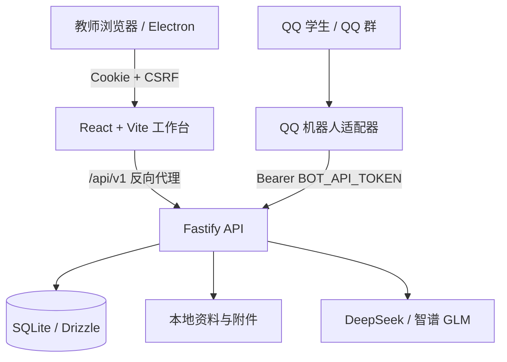

# 校园教务小助手（二代教秘）

校园教务小助手是一套面向高校教务老师的本地化工作平台。学生通过 QQ 私聊、群聊或群内 @ 提交文字、图片、语音和资料，教师通过网页或 Windows 桌面工作台维护知识、处理未命中问题、整理学生资料并发送群通知。

项目强调“经过核实的知识优先”：敏感词规则、FAQ 和资料型知识库先于大模型参与回答，模型主要用于候选匹配、检索增强、图片识别和语音转写，避免把未经确认的自由生成内容直接当作教务政策答案。

> 当前源码版本：`1.0.3`
>
> 主要运行方式：本地 Web 工作台、QQ 机器人适配器、Windows Electron 桌面程序

## 核心目标

- 让教师集中维护标准答案、敏感词、分类和资料型知识库。
- 通过 QQ 接收学生问题，并将不同入口统一接入同一套问答服务。
- 将无法可靠回答的问题进入待处理队列，由教师补充、关联或忽略。
- 支持面向多个已识别 QQ 群发送通知和附件，并记录逐群执行结果。
- 将账号、工作区、知识、模型配置、统计和运行数据保存在本机。
- 为前端、API、QQ 适配器和桌面程序提供清晰、可测试的边界。

## 已实现功能

| 功能域 | 当前能力 |
| --- | --- |
| 登录与账号 | 教师注册、教师登录、开发者登录、8 小时会话、退出、角色跳转、开发者重置教师口令 |
| 多账号与工作区 | 每个教师账号使用独立工作区，业务数据按工作区隔离 |
| 工作概览 | FAQ、待解答、待整理资料、请求量、命中率、模型状态和 QQ 状态汇总 |
| FAQ 与敏感词 | 查询、分页、分类、增删改、启停、版本冲突保护、批量操作、候选导入、Excel/ZIP 导入导出、附件管理 |
| 资料型知识库 | 文件夹、文档上传、解析进度、OCR、切片、知识图谱、混合检索、检索评估、重新解析和完整导出 |
| 问答引擎 | 敏感词规则、FAQ 精确/关键词匹配、模型候选选择、RAG 检索、人工兜底、请求去重和回答来源追踪 |
| 图片与语音 | 最多 3 张图片的问题提取；QQ WAV/MP3 语音转写；附件统一回传 |
| 待解答闭环 | 未命中聚合、人工分类、QQ 学生来源补录、创建 FAQ、关联已有知识、忽略和批量处理 |
| QQ 机器人 | AppID/AppSecret 本机保存、自动启动、暂停/恢复回答、连接心跳、离线问题补答和 Session 恢复 |
| QQ 群与通知 | 群识别、群备注、群号补录、启停、删除、通知正文与附件入队、领取、开始、回执和历史删除 |
| 资料收集箱 | QQ 资料上传、模型预分类、教师归档、单份/批量下载和删除 |
| 模型与额度 | DeepSeek、智谱 GLM 连接/断开、文字模型选择、视觉与语音能力、共享周期预算和 Token 统计 |
| 运维与交付 | 健康检查、SQLite WAL、数据库迁移、进程锁、备份恢复、源码/EXE/安装包构建和负载测试源码 |

当前版本不包含个人成绩查询、学生身份绑定、审批办理、定时提醒、学籍档案、云端多副本部署或面向学生的网页入口。

## 系统架构



主要工程目录：

```text
apps/web            React + Vite 教师工作台
apps/api            Fastify API、鉴权、业务服务和 SQLite 数据入口
apps/qq-bot         腾讯 QQ Bot SDK 适配器
packages/contracts  前后端共享 DTO、枚举和 JSON Schema
migrations          SQLite 数据库迁移
desktop             Electron 桌面壳与模型初始化
scripts             启动、检查、打包和负载测试工具
tests               单元、API、QQ 和 Playwright E2E 测试
docs                架构、使用、验收和维护文档
```

## 技术栈

- 前端：React、Vite、React Router、Fluent UI
- API：Node.js、TypeScript、Fastify、JSON Schema
- 数据：SQLite、Drizzle ORM、18 个幂等迁移
- QQ：腾讯 QQ Bot Node.js SDK
- 知识处理：PDF.js、Mammoth、ExcelJS、Tesseract.js、LangChain
- 桌面端：Electron、electron-builder
- 测试：Node.js Test Runner、Playwright、k6 测试脚本

## 环境要求

- Node.js `22.16.0` 或更高版本
- npm（使用仓库内的 `package-lock.json`）
- Windows x64：构建和使用当前桌面版时必需
- QQ 机器人功能：需要腾讯 QQ 开放平台应用和相应消息权限
- 模型功能：需要 DeepSeek 或智谱开放平台的有效 API Key

建议先在本机回环地址运行。需要在校园网或其他网络环境提供服务时，请额外配置 HTTPS、访问控制和准确的跨域来源。

## 快速开始

### 1. 获取源码并安装依赖

```powershell
git clone <你的仓库地址>
cd <仓库目录>
npm ci --ignore-scripts --no-audit --no-fund
```

`<你的仓库地址>` 和 `<仓库目录>` 是说明性占位符，请替换为实际值。

### 2. 配置环境变量

开发环境可以复制示例配置：

```powershell
Copy-Item .env.example .env
```

首次执行 `npm start` 或 `npm run setup` 时，未显式配置的本地口令和服务令牌会随机生成，并写入 Git 已忽略的本地目录。不要把这些文件提交到仓库。

### 3. 启动系统

```powershell
npm start
```

默认地址：

| 服务 | 地址 |
| --- | --- |
| 教师工作台 | `http://127.0.0.1:8080` |
| API | `http://127.0.0.1:3001/api/v1` |
| 开发模式前端 | `http://127.0.0.1:5173` |

Windows 用户也可以双击根目录的 `启动系统.cmd`，或使用 `快捷启动命令包/一键启动并打开.cmd`。

开发模式：

```powershell
npm run dev
```

如需从空知识库开始正式部署，可先初始化，再分别启动服务：

```powershell
npm run setup
npm run start:api

# 在另一个终端中执行
npm run start:web
```

## 环境变量

完整配置见 [`.env.example`](.env.example)。常用变量如下：

| 变量 | 用途 | 是否敏感 |
| --- | --- | --- |
| `API_HOST` / `API_PORT` | API 监听地址和端口 | 否 |
| `WEB_HOST` / `WEB_PORT` | Web 服务监听地址和端口 | 否 |
| `DATABASE_PATH` | SQLite 数据库路径 | 可能包含业务数据 |
| `ALLOWED_ORIGINS` | 允许发起写请求的浏览器来源 | 否 |
| `COOKIE_SECURE` | HTTPS 环境下启用安全 Cookie | 否 |
| `DEEPSEEK_API_KEY` | DeepSeek API 密钥 | 是 |
| `ZHIPU_API_KEY` | 智谱 API 密钥 | 是 |
| `BOT_API_TOKEN` | QQ 适配器调用内部 API 的服务令牌 | 是 |
| `QQBOT_CREDENTIALS_FILE` | 仓库外 QQ 凭证文件路径 | 是 |
| `VITE_API_BASE_URL` | 浏览器端 API 前缀，默认 `/api/v1` | 否 |

只有以 `VITE_` 开头的变量可能进入浏览器构建产物。不要把模型密钥、QQ AppSecret、服务令牌或口令放进任何 `VITE_` 变量。

## 模型配置

当前后端支持以下 provider：

- `deepseek`：文字问答与候选选择。
- `zhipu`：智谱 GLM 文字、视觉和语音能力。

推荐登录教师工作台后，在模型管理界面连接或断开模型并选择文字问答模型。模型密钥保存在本机后端数据目录中，前端不会读取或完整回显。

相关默认值可在 `.env` 中配置：

```dotenv
DEEPSEEK_API_KEY=
DEEPSEEK_BASE_URL=https://api.deepseek.com
DEEPSEEK_MODEL=deepseek-v4-flash

ZHIPU_API_KEY=
ZHIPU_BASE_URL=https://open.bigmodel.cn/api/paas/v4
ZHIPU_MODEL=glm-5.3-flash
ZHIPU_VISION_MODEL=glm-4.6v-flash
```

模型名称和可用能力可能随供应商调整，部署时应以对应平台账户实际可用的模型为准。

## QQ 机器人配置

1. 在腾讯 QQ 开放平台创建机器人并开通需要的事件与发送权限。
2. 启动主系统并登录教师工作台。
3. 在 QQ 机器人设置中保存 AppID 与 AppSecret。
4. 机器人适配器会自动连接；也可以单独运行：

```powershell
npm run start:bot
```

QQ 适配器和 API 分开部署时，二者必须使用相同的 `BOT_API_TOKEN`，`BOT_API_BASE_URL` 应指向可通过 HTTPS 访问的 API 地址。

平台是否允许主动群消息取决于 QQ 开放平台为该机器人授予的权限。代码完成入队和发送流程不代表账号已经获得相应平台权限。

## 前后端联调

前端统一通过 `VITE_API_BASE_URL` 调用 API；默认使用 `/api/v1`，由开发服务器或生产静态服务器反向代理到 `127.0.0.1:3001`。

### 浏览器请求

- 登录后使用 HttpOnly 的 `campus_session` Cookie。
- 浏览器请求需要携带 `credentials: include`。
- `POST`、`PATCH` 和 `DELETE` 请求需要携带 `X-CSRF-Token`。
- JSON 请求使用 `Content-Type: application/json`。
- 文件上传使用 `multipart/form-data`，不要手动设置 boundary。

### QQ 内部请求

- 使用 `Authorization: Bearer <BOT_API_TOKEN>`。
- 多工作区场景同时携带 `X-QQ-App-Id`，避免旧机器人串用工作区。
- `/api/v1/internal/qq/*` 不应暴露给普通浏览器或公网匿名访问。

### 主要接口分组

| 分组 | 路径示例 | 调用方 |
| --- | --- | --- |
| 健康与状态 | `/api/v1/health/live`、`/api/v1/health/ready`、`/api/v1/status` | 运维、桌面程序 |
| 认证 | `/api/v1/auth/login`、`/api/v1/auth/register`、`/api/v1/auth/session` | 登录页、认证上下文 |
| 工作台 | `/api/v1/admin/status` | Dashboard、状态侧栏 |
| FAQ 与分类 | `/api/v1/faqs`、`/api/v1/knowledge/categories` | 知识维护页 |
| RAG | `/api/v1/rag/tree`、`/api/v1/rag/documents`、`/api/v1/rag/search` | 资料型知识库 |
| 待解答 | `/api/v1/unmatched`、`/api/v1/unmatched/:id/resolve` | 待处理工作台 |
| QQ 与通知 | `/api/v1/admin/qq/groups`、`/api/v1/admin/notifications` | QQ 设置、通知页 |
| 资料收集箱 | `/api/v1/admin/materials` | 资料整理页 |
| 模型 | `/api/v1/admin/models`、`/api/v1/admin/answer/test` | 模型管理、问答测试 |
| QQ 内部接口 | `/api/v1/internal/qq/*` | QQ 适配器 |

当前源码注册了 96 个 API 路由。教师登录后可访问 `/api/v1/admin/openapi` 获取运行时 Swagger 文档。根目录 [`openapi.json`](openapi.json) 是静态快照，联调时应以运行时文档和当前路由实现为准。

统一错误结构：

```json
{
  "error": {
    "code": "ERROR_CODE",
    "message": "可读错误信息"
  },
  "requestId": "请求追踪标识"
}
```

## 数据与运维

默认数据库为 `data/campus.db`，使用 SQLite WAL 模式。启动时会自动执行幂等迁移。`data/`、`.local/`、日志、数据库、密钥和构建产物均已加入 `.gitignore`。

常用命令：

```powershell
npm run db:backup
npm run db:restore -- --file "D:\backup\campus.db" --confirm
npm run admin:reset
npm run faq:import -- --file "D:\data\faqs.json"
npm run faq:export -- --file "D:\backup\faqs.json"
npm run check
```

FAQ 导入示例见 [`docs/faq-import.example.json`](docs/faq-import.example.json)。

## 开发、测试与构建

```powershell
npm run build          # 构建 API、QQ 适配器和 Web
npm run typecheck      # TypeScript 类型检查
npm test               # 单元、API 和服务测试
npm run test:e2e       # Playwright 端到端测试
npm run benchmark      # 本机问答路径基准测试
npm run test:load      # k6 负载测试入口
npm run desktop:dev    # 构建并启动 Electron
npm run desktop:package
npm run desktop:installer
npm run package        # 生成源码交付包
```

首次运行 Playwright 测试前需要安装浏览器：

```powershell
npx playwright install chromium
```

## 桌面版

构建 Windows x64 便携版：

```powershell
npm run desktop:package
```

构建安装包：

```powershell
npm run desktop:installer
```

输出目录为 `release/desktop/`，该目录不会提交到 Git。更多信息见 [`docs/桌面版使用说明.md`](docs/桌面版使用说明.md) 和 [`docs/便携版打包维护说明.md`](docs/便携版打包维护说明.md)。

## 安全与隐私

公开仓库中不得提交以下内容：

- `.env` 和任何真实环境变量文件
- QQ AppID/AppSecret、模型 API Key、服务令牌和账号口令
- `data/`、`.local/`、SQLite 数据库及其 WAL/SHM 文件
- 学生问题、QQ 号码、原始资料、通知内容和生产日志
- `node_modules/`、桌面运行时、EXE、安装包和测试报告

提交前至少执行：

```powershell
git status --short
git diff --cached
```

不要在 Issue、Pull Request、截图或日志中发布真实学生数据和可用凭证。安全问题请按照 [`SECURITY.md`](SECURITY.md) 通过私密渠道报告。

## 已知限制

- QQ 主动群消息必须由平台授予对应权限，应用逻辑无法绕过平台限制。
- 本项目默认面向单机和本地网络场景，未提供云端高可用、多副本或集中式密钥服务。
- 本地 SQLite 适合当前工作台规模；多人跨机器协同时需要重新评估数据库和文件存储方案。
- 根目录静态 `openapi.json` 可能落后于运行时代码，发布版本前应重新生成并冻结接口文档。
- “已实现”表示源码中已存在相应路径，不代表第三方平台权限、模型账户余额或本地构建环境已经验收通过。

## 文档

- [`docs/架构与设计.md`](docs/架构与设计.md)：系统边界和技术设计
- [`docs/交付验收说明.md`](docs/交付验收说明.md)：交付与验收记录
- [`docs/模型与周额度使用说明.md`](docs/模型与周额度使用说明.md)：模型配置和额度规则
- [`docs/群通知修复说明.md`](docs/群通知修复说明.md)：群通知链路与平台限制
- [`docs/稳定性测试报告.md`](docs/稳定性测试报告.md)：稳定性与负载测试记录
- [`docs/本次工作台更新说明.md`](docs/本次工作台更新说明.md)：工作台变更说明

## 贡献

欢迎通过 Issue 报告可复现问题，或通过 Pull Request 提交聚焦、可测试的改动。提交代码前请运行与改动范围相匹配的类型检查和测试，并确保没有加入凭证、数据库、真实学生数据或本机构建产物。

## 许可证

本仓库当前尚未包含 `LICENSE` 文件。公开可见不等同于获得开源使用许可；在维护者选择并添加许可证之前，代码保留全部权利。
