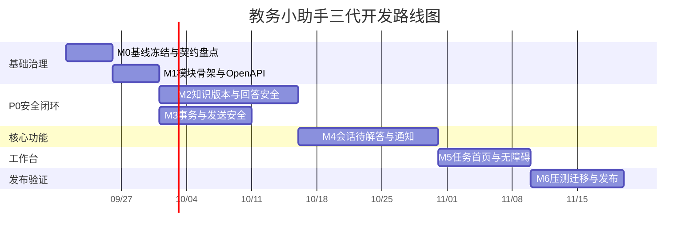

# 教务小助手三代升级实施计划

> **For Claude:** REQUIRED SUB-SKILL: Use superpowers:executing-plans to implement this plan task-by-task.

**Goal:** 在保持单机桌面部署和 v1.0.3 数据可升级的前提下，实现确定性可追溯问答、可恢复后台任务、多轮追问、待解答闭环、通知优化和教师任务工作台，并通过 20 条消息/秒峰值与全部 P0 门禁。

**Architecture:** 使用可演进模块化单体。Electron 管理 API、Worker 和 QQ 适配器进程；Fastify 路由按领域拆分；Web 与 QQ 共用 `AnswerApplicationService`；SQLite WAL 保存业务数据、任务和 Outbox；仓储、文件、任务、模型和渠道通过接口隔离。

**Tech Stack:** TypeScript 5.9、Node.js 22、Fastify 5、React 19、Vite 8、Electron 44、Drizzle ORM、better-sqlite3、Playwright、Node Test Runner、k6。

---

## 实施约束

- 基线提交为 `398e79d`，架构规格提交为 `44658c3`。
- 首发只监听 `127.0.0.1`，不增加公网入口。
- 每个任务先写失败测试，再实现最小改动，最后运行局部测试和全量检查。
- 不执行真实 QQ、真实付费模型或真实数据迁移，除非获得单独授权。
- 每个数据库迁移只能扩展结构或回填数据，不删除旧列和旧表。
- 旧接口至少保留一个发布周期，并通过兼容性测试。
- 不把现有未跟踪的题库文档自动加入任何实施提交。

## 里程碑



## Task 1 建立三代基线门禁

**Files:**

- Create: `tests/architecture-baseline.test.ts`
- Create: `scripts/export-openapi.ts`
- Create: `docs/api/openapi-v1.0.3.json`
- Modify: `package.json`
- Modify: `.gitignore`

**Step 1: 写失败测试**

在 `tests/architecture-baseline.test.ts` 中验证：

- 运行时 OpenAPI 至少包含现有 96 个路由。
- `/admin/answer/test` 和 `/internal/qq/answer` 的回答响应字段一致。
- API、QQ 和 Web 构建入口存在。
- `work/`、运行数据库、密钥和渲染产物不会进入 Git。

**Step 2: 运行测试并确认失败**

Run: `npx tsx --test tests/architecture-baseline.test.ts`

Expected: 因缺少冻结快照和导出脚本而失败。

**Step 3: 实现 OpenAPI 导出脚本**

`scripts/export-openapi.ts` 使用内存 Store 创建应用，调用 `app.swagger()`，按 HTTP 方法和路径稳定排序后写入指定文件。`package.json` 增加：

```json
"api:export": "tsx scripts/export-openapi.ts"
```

更新 `.gitignore`，明确排除 `work/`、`data/`、`.local/`、`qa/load-*` 和文档渲染目录。

**Step 4: 生成并验证快照**

Run: `npm run api:export -- docs/api/openapi-v1.0.3.json`

Run: `npx tsx --test tests/architecture-baseline.test.ts`

Expected: PASS，快照覆盖源码注册路由。

**Step 5: 提交**

```powershell
git add package.json .gitignore scripts/export-openapi.ts tests/architecture-baseline.test.ts docs/api/openapi-v1.0.3.json
git commit -m "test: freeze v1 api and architecture baseline"
```

## Task 2 拆分共享契约并生成前端客户端

**Files:**

- Create: `packages/contracts/src/common.ts`
- Create: `packages/contracts/src/answers.ts`
- Create: `packages/contracts/src/conversations.ts`
- Create: `packages/contracts/src/jobs.ts`
- Create: `packages/contracts/src/knowledge.ts`
- Create: `packages/contracts/src/notifications.ts`
- Create: `packages/contracts/src/unmatched.ts`
- Create: `apps/web/src/api/generated.ts`
- Create: `scripts/generate-api-client.ts`
- Create: `tests/contracts.test.ts`
- Modify: `packages/contracts/src/index.ts`
- Modify: `package.json`

**Step 1: 写失败的契约测试**

验证错误响应、分页、版本字段、回答追踪、任务状态、会话和知识版本 Schema。测试必须拒绝额外字段，并验证旧 `AnswerResult` 仍可解析。

定义并测试以下核心联合类型：

```ts
export type JobStatus =
  | 'pending' | 'claimed' | 'processing'
  | 'succeeded' | 'failed' | 'unknown' | 'cancelled';

export type InputIntent =
  | 'academic_question' | 'context_update' | 'confirmation'
  | 'negation' | 'small_talk' | 'material_upload' | 'sensitive_personal';
```

**Step 2: 运行测试并确认失败**

Run: `npx tsx --test tests/contracts.test.ts`

**Step 3: 按领域移动类型**

`packages/contracts/src/index.ts` 只重新导出领域文件，保持原导入路径可用。不能在契约包中引入数据库、Fastify、React 或模型客户端。

**Step 4: 生成前端客户端**

`scripts/generate-api-client.ts` 从 OpenAPI 快照生成稳定的路径常量、请求类型和响应类型到 `apps/web/src/api/generated.ts`。生成文件顶部写入来源快照哈希，CI 在哈希变化时失败。

**Step 5: 验证**

Run: `npx tsx --test tests/contracts.test.ts`

Run: `npm run typecheck`

Expected: PASS。

**Step 6: 提交**

```powershell
git add packages/contracts apps/web/src/api/generated.ts scripts/generate-api-client.ts tests/contracts.test.ts package.json
git commit -m "refactor: split contracts and generate api client"
```

## Task 3 按领域拆分 Fastify 路由

**Files:**

- Create: `apps/api/src/http/context.ts`
- Create: `apps/api/src/http/guards.ts`
- Create: `apps/api/src/http/errors.ts`
- Create: `apps/api/src/modules/auth/routes.ts`
- Create: `apps/api/src/modules/knowledge/routes.ts`
- Create: `apps/api/src/modules/answering/routes.ts`
- Create: `apps/api/src/modules/conversations/routes.ts`
- Create: `apps/api/src/modules/unmatched/routes.ts`
- Create: `apps/api/src/modules/notifications/routes.ts`
- Create: `apps/api/src/modules/operations/routes.ts`
- Create: `tests/route-compatibility.test.ts`
- Modify: `apps/api/src/app.ts`

**Step 1: 写路由兼容测试**

从 v1.0.3 OpenAPI 快照读取方法和路径，对新应用逐一检查。比较认证要求、成功状态码、主要响应字段和统一错误格式。

**Step 2: 运行测试并确认失败**

Run: `npx tsx --test tests/route-compatibility.test.ts`

**Step 3: 提取请求上下文和守卫**

`http/context.ts` 定义请求的用户、角色、工作区、CSRF 和关联 ID。`http/guards.ts` 提供公开、会话、教师写入、开发者解锁和 QQ 服务鉴权。所有工作区切换必须发生在请求作用域，不能依赖跨请求可变全局状态。

**Step 4: 逐域迁移路由**

每迁移一个域，立即运行兼容测试。`app.ts` 最终只负责插件、错误处理、依赖组装和领域路由注册。

**Step 5: 验证**

Run: `npx tsx --test tests/route-compatibility.test.ts tests/api.test.ts tests/accounts.test.ts`

Run: `npm run typecheck`

Expected: PASS，现有接口行为未改变。

**Step 6: 提交**

```powershell
git add apps/api/src/app.ts apps/api/src/http apps/api/src/modules tests/route-compatibility.test.ts
git commit -m "refactor: split api routes by domain"
```

## Task 4 建立仓储和事务边界

**Files:**

- Create: `apps/api/src/core/unit-of-work.ts`
- Create: `apps/api/src/modules/knowledge/repository.ts`
- Create: `apps/api/src/modules/answering/repository.ts`
- Create: `apps/api/src/modules/conversations/repository.ts`
- Create: `apps/api/src/modules/unmatched/repository.ts`
- Create: `apps/api/src/modules/notifications/repository.ts`
- Create: `apps/api/src/infrastructure/sqlite/unit-of-work.ts`
- Create: `apps/api/src/infrastructure/sqlite/*-repository.ts`
- Create: `tests/repository-contracts.test.ts`
- Modify: `apps/api/src/db/store.ts`

**Step 1: 写仓储契约测试**

使用内存 SQLite 对每个仓储运行相同测试，覆盖工作区隔离、乐观版本冲突、事务回滚和稳定分页。两个并发处理者更新同一待解答记录时，只允许一个提交成功。

**Step 2: 运行测试并确认失败**

Run: `npx tsx --test tests/repository-contracts.test.ts`

**Step 3: 定义 Unit of Work**

```ts
export interface UnitOfWork {
  transaction<T>(operation: (repositories: Repositories) => T): T;
}
```

领域服务不得接收 `better-sqlite3` 实例。`store.ts` 暂时作为兼容门面，逐步委托给新仓储。

**Step 4: 验证**

Run: `npx tsx --test tests/repository-contracts.test.ts tests/operations.test.ts tests/knowledge-center.test.ts`

Expected: PASS。

**Step 5: 提交**

```powershell
git add apps/api/src/core apps/api/src/modules apps/api/src/infrastructure/sqlite apps/api/src/db/store.ts tests/repository-contracts.test.ts
git commit -m "refactor: add repositories and unit of work"
```

## Task 5 增加题库版本、相似问法和知识版本

**Files:**

- Create: `migrations/019_faq_versions_and_variants.sql`
- Create: `migrations/020_knowledge_versions_and_evidence.sql`
- Create: `apps/api/src/modules/knowledge/version-service.ts`
- Create: `apps/api/src/modules/knowledge/variant-service.ts`
- Create: `tests/knowledge-versions.test.ts`
- Create: `tests/faq-variants.test.ts`
- Modify: `apps/api/src/db/schema.ts`
- Modify: `apps/api/src/modules/knowledge/routes.ts`

**Step 1: 写迁移和领域失败测试**

验证：

- 每个现有 FAQ 回填一个版本快照。
- 每个工作区生成一个初始知识版本。
- 相似问法继承标准答案，但具有独立状态、版本和命中数。
- 启用相似问法前必须审核。
- 激活新知识版本会使旧匹配决策缓存失效。
- 旧数据库升级后 FAQ 数量和内容校验值不变。

**Step 2: 运行测试并确认失败**

Run: `npx tsx --test tests/knowledge-versions.test.ts tests/faq-variants.test.ts`

**Step 3: 实现迁移和服务**

`019` 创建 `faq_versions` 和 `faq_variants`。`020` 创建 `knowledge_versions`、`evidence_refs`，并扩展 RAG 文档与分块的页码、表格位置、标题路径、父块、OCR 置信度和内容哈希。

**Step 4: 验证**

Run: `npx tsx --test tests/knowledge-versions.test.ts tests/faq-variants.test.ts tests/knowledge-center.test.ts`

Run: `npm run typecheck`

**Step 5: 提交**

```powershell
git add migrations/019_faq_versions_and_variants.sql migrations/020_knowledge_versions_and_evidence.sql apps/api/src/db/schema.ts apps/api/src/modules/knowledge tests/knowledge-versions.test.ts tests/faq-variants.test.ts
git commit -m "feat: add versioned knowledge and faq variants"
```

## Task 6 实现确定性检索和匹配决策

**Files:**

- Create: `apps/api/src/modules/answering/fingerprint.ts`
- Create: `apps/api/src/modules/answering/retrieval.ts`
- Create: `apps/api/src/modules/answering/rrf.ts`
- Create: `apps/api/src/modules/answering/match-decision.ts`
- Create: `apps/api/src/modules/answering/decision-cache.ts`
- Create: `tests/answer-determinism.test.ts`
- Create: `tests/answer-negation.test.ts`
- Modify: `apps/api/src/services/policy.ts`
- Modify: `apps/api/src/services/hybrid-retriever.ts`

**Step 1: 写失败测试**

测试缓考与补考、允许与不允许、不同校区和不同时间范围。每个样本在同一知识版本运行 20 次，比较候选顺序、FAQ ID、关键事实和结论。

**Step 2: 运行测试并确认失败**

Run: `npx tsx --test tests/answer-determinism.test.ts tests/answer-negation.test.ts`

**Step 3: 实现固定算法**

- 指纹输入包含工作区、规范化问题、事项、对象、时间、校区、否定关系、知识版本和参数版本。
- 关键词、向量和知识图谱的 RRF 常量放入版本化配置。
- 候选使用分数、来源优先级和稳定 ID 排序。
- 缓存键包含知识版本；激活新版本后不读取旧缓存。
- 模型只能选择白名单 ID，并返回 `clear`、`ambiguous` 或 `none`。

**Step 4: 验证**

Run: `npx tsx --test tests/answer-determinism.test.ts tests/answer-negation.test.ts tests/models.test.ts`

Expected: 20 次结果一致，否定和相邻事项不误命中。

**Step 5: 提交**

```powershell
git add apps/api/src/modules/answering apps/api/src/services/policy.ts apps/api/src/services/hybrid-retriever.ts tests/answer-determinism.test.ts tests/answer-negation.test.ts
git commit -m "feat: make answer retrieval deterministic"
```

## Task 7 建立回答追踪、证据和完整性检查

**Files:**

- Create: `migrations/021_answer_runs_and_decisions.sql`
- Create: `apps/api/src/modules/answering/evidence-policy.ts`
- Create: `apps/api/src/modules/answering/completeness.ts`
- Create: `apps/api/src/modules/answering/answer-application-service.ts`
- Create: `apps/api/src/modules/answering/replay-service.ts`
- Create: `tests/answer-evidence.test.ts`
- Create: `tests/answer-completeness.test.ts`
- Create: `tests/answer-replay.test.ts`
- Modify: `apps/api/src/services/answer.ts`
- Modify: `apps/api/src/modules/answering/routes.ts`

**Step 1: 写失败测试**

验证所有关键结论都绑定证据；日期、地点、对象、联系人和条件不能来自证据外；资料冲突和证据不足必须拒答或转人工。回放使用原知识版本，并能返回首次分叉节点。

**Step 2: 运行测试并确认失败**

Run: `npx tsx --test tests/answer-evidence.test.ts tests/answer-completeness.test.ts tests/answer-replay.test.ts`

**Step 3: 实现数据与服务**

`021` 创建 `answer_runs`、`classification_decisions`、`match_decisions` 和证据关联。`AnswerApplicationService` 成为 Web、QQ 和回放的唯一入口。旧 `AnswerService` 作为兼容门面，不能再包含渠道专属事实决策。

**Step 4: 增加新路由和兼容路由**

- `POST /answers`
- `GET /answers/:id/trace`
- `POST /answers/:id/replay`

旧 `/admin/answer/test` 与 `/internal/qq/answer` 调用相同应用服务并保留原响应字段。

**Step 5: 验证**

Run: `npx tsx --test tests/answer-evidence.test.ts tests/answer-completeness.test.ts tests/answer-replay.test.ts tests/api.test.ts tests/qq-reply-policy.test.ts`

Expected: 证据覆盖率 100%，Web 与 QQ 的事实字段一致。

**Step 6: 提交**

```powershell
git add migrations/021_answer_runs_and_decisions.sql apps/api/src/modules/answering apps/api/src/services/answer.ts tests/answer-evidence.test.ts tests/answer-completeness.test.ts tests/answer-replay.test.ts
git commit -m "feat: add evidence backed answer runs"
```

## Task 8 实现持久任务与 Outbox

**Files:**

- Create: `migrations/022_jobs_outbox_and_attempts.sql`
- Create: `apps/api/src/modules/jobs/types.ts`
- Create: `apps/api/src/modules/jobs/repository.ts`
- Create: `apps/api/src/modules/jobs/job-service.ts`
- Create: `apps/api/src/modules/jobs/retry-policy.ts`
- Create: `apps/api/src/worker.ts`
- Create: `apps/api/src/workers/material-parser.ts`
- Create: `apps/api/src/workers/knowledge-indexer.ts`
- Create: `apps/api/src/workers/notification-sender.ts`
- Create: `apps/api/src/workers/unmatched-replier.ts`
- Create: `tests/jobs.test.ts`
- Create: `tests/outbox.test.ts`
- Create: `tests/job-recovery.test.ts`
- Modify: `apps/api/tsup.config.ts`
- Modify: `scripts/stack.mjs`
- Modify: `desktop/main.cjs`

**Step 1: 写失败测试**

覆盖事务内创建任务、原子领取、租约到期、退避重试、进程重启、取消和 `unknown` 状态。模拟平台在请求送达后断开连接，确认系统不自动重发。

**Step 2: 运行测试并确认失败**

Run: `npx tsx --test tests/jobs.test.ts tests/outbox.test.ts tests/job-recovery.test.ts`

**Step 3: 实现迁移和状态机**

`022` 创建 `async_jobs`、`job_attempts` 和 `outbox_events`。任务领取使用单条条件更新和租约令牌。Worker 只处理已注册任务类型；未知类型进入失败状态并记录错误码。

**Step 4: 拆出 Worker 入口**

`apps/api/tsup.config.ts` 增加 `src/worker.ts`。`scripts/stack.mjs` 与 Electron 进程主管启动并监控 Worker。Worker 停止不影响登录、查询和实时 FAQ 请求。

**Step 5: 验证**

Run: `npx tsx --test tests/jobs.test.ts tests/outbox.test.ts tests/job-recovery.test.ts tests/process-lock.test.ts`

Run: `npm run build`

Expected: PASS，重启后任务恢复，未知发送不重试。

**Step 6: 提交**

```powershell
git add migrations/022_jobs_outbox_and_attempts.sql apps/api/src/modules/jobs apps/api/src/workers apps/api/src/worker.ts apps/api/tsup.config.ts scripts/stack.mjs desktop/main.cjs tests/jobs.test.ts tests/outbox.test.ts tests/job-recovery.test.ts
git commit -m "feat: add durable jobs and transactional outbox"
```

## Task 9 实现多轮会话和受控意图

**Files:**

- Create: `migrations/023_conversations_and_slots.sql`
- Create: `apps/api/src/modules/conversations/intent-classifier.ts`
- Create: `apps/api/src/modules/conversations/slot-policy.ts`
- Create: `apps/api/src/modules/conversations/conversation-service.ts`
- Create: `tests/intent-classification.test.ts`
- Create: `tests/conversation-isolation.test.ts`
- Create: `tests/follow-up-policy.test.ts`
- Modify: `apps/qq-bot/src/session.ts`
- Modify: `apps/qq-bot/src/index.ts`

**Step 1: 写黄金集失败测试**

黄金集覆盖教务问题、上下文补充、确认否定、闲聊、资料上传说明和敏感个人业务。测试问题识别 F1 不低于 0.93，非问题输入不创建待解答。

**Step 2: 写会话失败测试**

验证工作区、渠道、会话目标和发送者四级隔离；私聊与群聊不互串；重复平台消息只处理一次；乱序消息不会覆盖新槽位；同一缺失项不重复追问；默认最多两轮。

**Step 3: 实现迁移和服务**

`023` 创建 `conversations`、`conversation_messages` 和 `conversation_slots`。槽位保存来源消息、置信度和已追问状态。追问策略每轮只选择对当前事项答案影响最大的一个缺失槽位。

**Step 4: 验证**

Run: `npx tsx --test tests/intent-classification.test.ts tests/conversation-isolation.test.ts tests/follow-up-policy.test.ts tests/qq-reply-policy.test.ts`

Expected: 达到 F1 门槛，两轮完成率不低于 80%，隔离测试无泄漏。

**Step 5: 提交**

```powershell
git add migrations/023_conversations_and_slots.sql apps/api/src/modules/conversations apps/qq-bot/src/session.ts apps/qq-bot/src/index.ts tests/intent-classification.test.ts tests/conversation-isolation.test.ts tests/follow-up-policy.test.ts
git commit -m "feat: add isolated multi turn conversations"
```

## Task 10 重构待解答处理闭环

**Files:**

- Create: `migrations/024_question_actions.sql`
- Create: `apps/api/src/modules/unmatched/quick-answer-service.ts`
- Create: `apps/api/src/modules/unmatched/link-question-service.ts`
- Create: `tests/unmatched-workflow.test.ts`
- Modify: `apps/api/src/modules/unmatched/routes.ts`
- Create: `apps/web/src/pages/unmatched/UnmatchedPage.tsx`
- Create: `apps/web/src/pages/unmatched/QuickAnswerDialog.tsx`
- Create: `apps/web/src/pages/unmatched/LinkQuestionDialog.tsx`
- Modify: `apps/web/src/pages/Knowledge.tsx`
- Modify: `apps/web/src/api/generated.ts`

**Step 1: 写失败测试**

验证三类记录互斥：待人工解答、非教务问题、服务中断未答。验证快速解答的“仅回复本次”和“回复并新增标准题”，以及关联问题、保存相似问法、改分类、撤销查看、版本冲突和失败回滚。

**Step 2: 运行测试并确认失败**

Run: `npx tsx --test tests/unmatched-workflow.test.ts tests/unmatched-students.test.ts`

**Step 3: 实现服务与接口**

- `POST /unmatched/:id/quick-answer`
- `POST /unmatched/:id/link-question`
- `PATCH /unmatched/:id/classification`
- `GET /unmatched/:id/actions`

处理记录、创建或关联 FAQ、保存相似问法和回发任务必须在一个事务内完成。

**Step 4: 实现前端**

筛选增加紧急度、出现次数、最近出现、来源渠道和分类置信度。关联问题面板展示标准问题、答案摘要、状态、版本、分类和匹配理由。

**Step 5: 验证**

Run: `npx tsx --test tests/unmatched-workflow.test.ts tests/unmatched-students.test.ts tests/operations.test.ts`

Run: `npx playwright test tests/e2e/unmatched-students.spec.ts tests/e2e/review-and-errors.spec.ts`

**Step 6: 提交**

```powershell
git add migrations/024_question_actions.sql apps/api/src/modules/unmatched apps/web/src/pages/Knowledge.tsx apps/web/src/pages/unmatched apps/web/src/api/generated.ts tests/unmatched-workflow.test.ts tests/e2e/unmatched-students.spec.ts tests/e2e/review-and-errors.spec.ts
git commit -m "feat: rebuild unmatched question workflow"
```

## Task 11 重构通知、回发和文案优化

**Files:**

- Create: `migrations/025_delivery_visibility_and_optimization.sql`
- Create: `apps/api/src/modules/notifications/visibility-service.ts`
- Create: `apps/api/src/modules/notifications/optimization-service.ts`
- Create: `apps/api/src/modules/notifications/fact-diff.ts`
- Create: `tests/notification-visibility.test.ts`
- Create: `tests/content-optimization.test.ts`
- Modify: `apps/api/src/modules/notifications/routes.ts`
- Modify: `apps/web/src/pages/Notifications.tsx`

**Step 1: 写失败测试**

验证：只有终态记录可隐藏；选择本页和全选当前筛选结果使用服务端筛选快照；隐藏不删除目标、回执和幂等信息；标题建议为 8 至 30 字；正文支持简洁、正式和温和提醒；优化不触发发送；日期、地点、对象、联系人、数字或附件名变化时禁止一键覆盖。

**Step 2: 运行测试并确认失败**

Run: `npx tsx --test tests/notification-visibility.test.ts tests/content-optimization.test.ts tests/notification-delivery.test.ts`

**Step 3: 实现迁移和服务**

`025` 创建 `notification_visibility`、`delivery_attempts` 和 `content_optimization_runs`。优化结果使用短期指纹缓存和两秒防抖；额度预占、结算和审计沿用模型预算服务。

**Step 4: 实现前端差异确认**

字段级差异区分安全文本调整与关键事实变化。关键事实变化使用文字和图标说明，不能只使用颜色。教师确认后才替换草稿。

**Step 5: 验证**

Run: `npx tsx --test tests/notification-visibility.test.ts tests/content-optimization.test.ts tests/notifications.test.ts tests/notification-delivery.test.ts`

Run: `npx playwright test tests/e2e/notification-features.spec.ts tests/e2e/notification-delete.spec.ts`

**Step 6: 提交**

```powershell
git add migrations/025_delivery_visibility_and_optimization.sql apps/api/src/modules/notifications apps/web/src/pages/Notifications.tsx tests/notification-visibility.test.ts tests/content-optimization.test.ts tests/e2e/notification-features.spec.ts tests/e2e/notification-delete.spec.ts
git commit -m "feat: add safe notification optimization and visibility"
```

## Task 12 把资料解析迁入 Worker

**Files:**

- Create: `tests/material-job-recovery.test.ts`
- Create: `tests/rag-metadata.test.ts`
- Modify: `apps/api/src/services/rag.ts`
- Modify: `apps/api/src/services/rag-workbook.ts`
- Modify: `apps/api/src/modules/knowledge/routes.ts`
- Modify: `apps/api/src/workers/material-parser.ts`
- Modify: `apps/api/src/workers/knowledge-indexer.ts`

**Step 1: 写失败测试**

上传接口必须快速返回 `jobId`。解析进度写入任务记录。Worker 崩溃后任务恢复。每个分块保留知识版本、生效日期、页码或表格位置、标题路径、父子块、OCR 置信度和来源哈希。

**Step 2: 运行测试并确认失败**

Run: `npx tsx --test tests/material-job-recovery.test.ts tests/rag-metadata.test.ts tests/materials.test.ts`

**Step 3: 移动耗时工作**

API 只校验、保存原文件和创建任务。Worker 负责 OCR、分段、图谱和索引写入。解析与索引分别设为单并发，并记录 CPU 时间、内存峰值和处理字节数。

**Step 4: 验证**

Run: `npx tsx --test tests/material-job-recovery.test.ts tests/rag-metadata.test.ts tests/materials.test.ts tests/knowledge-center.test.ts`

Expected: API 在后台解析期间仍能处理健康检查和 FAQ 查询。

**Step 5: 提交**

```powershell
git add apps/api/src/services/rag.ts apps/api/src/services/rag-workbook.ts apps/api/src/modules/knowledge apps/api/src/workers tests/material-job-recovery.test.ts tests/rag-metadata.test.ts
git commit -m "refactor: move document parsing to worker"
```

## Task 13 重构教师任务工作台

**Files:**

- Create: `apps/web/src/pages/dashboard/ServiceStatus.tsx`
- Create: `apps/web/src/pages/dashboard/CoreMetrics.tsx`
- Create: `apps/web/src/pages/dashboard/PriorityTasks.tsx`
- Create: `apps/web/src/pages/dashboard/QuickActions.tsx`
- Create: `apps/web/src/pages/dashboard/QualityTrend.tsx`
- Create: `apps/web/src/hooks/useRemoteState.ts`
- Create: `tests/e2e/dashboard-workbench.spec.ts`
- Modify: `apps/web/src/pages/Dashboard.tsx`
- Modify: `apps/web/src/service-status.tsx`
- Modify: `apps/web/src/styles.css`
- Modify: `apps/api/src/modules/operations/routes.ts`

**Step 1: 写 E2E 失败测试**

测试异常与待办、服务状态、四项指标、快捷动作、7/30 天趋势和质量区块的顺序。模拟加载、空、陈旧、错误和成功状态。轮询失败后必须显示陈旧提示和诊断入口。

**Step 2: 运行测试并确认失败**

Run: `npx playwright test tests/e2e/dashboard-workbench.spec.ts`

**Step 3: 实现后端聚合**

`GET /service-status` 分别返回消息接收、QQ 回答、主动群发、文字模型、RAG 索引和 Worker 的服务端确认状态。首页统计复用单次聚合结果，避免每次渲染重复构造格式化器或重复扫描历史记录。

**Step 4: 实现前端顺序和状态**

使用 `useRemoteState` 统一远程状态。快捷入口指向处理待解答、发送通知、新增知识和运行评测。趋势切换为 7 天和 30 天，并显示指标口径。

**Step 5: 验证**

Run: `npx playwright test tests/e2e/dashboard-workbench.spec.ts tests/e2e/service-switches.spec.ts`

Run: `npm run typecheck`

**Step 6: 提交**

```powershell
git add apps/web/src/pages/Dashboard.tsx apps/web/src/pages/dashboard apps/web/src/hooks/useRemoteState.ts apps/web/src/service-status.tsx apps/web/src/styles.css apps/api/src/modules/operations tests/e2e/dashboard-workbench.spec.ts
git commit -m "feat: turn dashboard into teacher task workbench"
```

## Task 14 拆分知识中心并补齐交互状态

**Files:**

- Create: `apps/web/src/pages/knowledge/FaqBankPage.tsx`
- Create: `apps/web/src/pages/knowledge/FaqEditorDialog.tsx`
- Create: `apps/web/src/pages/knowledge/FaqVariantsPanel.tsx`
- Create: `apps/web/src/pages/knowledge/KnowledgeTreePage.tsx`
- Create: `apps/web/src/pages/knowledge/EvaluationPanel.tsx`
- Create: `apps/web/src/components/AsyncBoundary.tsx`
- Create: `apps/web/src/components/AppDialog.tsx`
- Create: `tests/e2e/accessibility-and-ime.spec.ts`
- Modify: `apps/web/src/pages/KnowledgeCenter.tsx`
- Modify: `apps/web/src/knowledge-center.css`

**Step 1: 写交互失败测试**

覆盖中文输入法组合期间 Enter 不提交、Escape 关闭、关闭后焦点返回、失败后遮罩销毁、390px 无页面横向滚动、关键操作可见、颜色不是唯一分类信号。

**Step 2: 运行测试并确认失败**

Run: `npx playwright test tests/e2e/accessibility-and-ime.spec.ts tests/e2e/knowledge-center.spec.ts`

**Step 3: 拆分组件**

保留 `KnowledgeCenter.tsx` 作为路由装配层。数据加载、编辑表单、附件、相似问法、RAG 树和评测分别进入独立组件。`AppDialog` 统一处理焦点、取消、提交失败和输入法组合状态。

**Step 4: 验证**

Run: `npx playwright test tests/e2e/accessibility-and-ime.spec.ts tests/e2e/knowledge-center.spec.ts tests/e2e/workspace-layout.spec.ts`

Run: `npm run typecheck`

**Step 5: 提交**

```powershell
git add apps/web/src/pages/KnowledgeCenter.tsx apps/web/src/pages/knowledge apps/web/src/components apps/web/src/knowledge-center.css tests/e2e/accessibility-and-ime.spec.ts
git commit -m "refactor: split knowledge center and unify dialog states"
```

## Task 15 增加一致性评测和黄金集

**Files:**

- Create: `qa/golden/intent-cases.json`
- Create: `qa/golden/high-risk-answer-cases.json`
- Create: `qa/golden/completeness-cases.json`
- Create: `apps/api/src/modules/operations/evaluation-service.ts`
- Create: `apps/api/src/modules/operations/consistency-service.ts`
- Create: `tests/evaluation-metrics.test.ts`
- Modify: `apps/api/src/modules/operations/routes.ts`
- Modify: `apps/web/src/pages/knowledge/EvaluationPanel.tsx`

**Step 1: 写指标失败测试**

使用固定黄金集计算问题识别 F1、高风险错误率、证据覆盖率、关键信息覆盖率和两轮补全率。指标计算必须可重复，并保存知识版本、模型、提示词和参数版本。

**Step 2: 运行测试并确认失败**

Run: `npx tsx --test tests/evaluation-metrics.test.ts`

**Step 3: 实现评测和回放**

索引、模型、提示词或检索参数变化后创建评测任务。结果展示失败样本和首次分叉节点，不只展示总分。

**Step 4: 验证**

Run: `npx tsx --test tests/evaluation-metrics.test.ts tests/answer-replay.test.ts`

Expected: F1、错误率、覆盖率和补全率计算与手工样本一致。

**Step 5: 提交**

```powershell
git add qa/golden apps/api/src/modules/operations apps/web/src/pages/knowledge/EvaluationPanel.tsx tests/evaluation-metrics.test.ts
git commit -m "feat: add golden set evaluation and consistency replay"
```

## Task 16 增加凭据保护和结构化可观测性

**Files:**

- Create: `apps/api/src/infrastructure/secrets/secret-store.ts`
- Create: `apps/api/src/infrastructure/secrets/windows-dpapi-store.ts`
- Create: `apps/api/src/observability/logger.ts`
- Create: `apps/api/src/observability/metrics.ts`
- Create: `tests/secrets.test.ts`
- Create: `tests/observability.test.ts`
- Modify: `apps/api/src/services/model-settings.ts`
- Modify: `apps/api/src/services/bot-control.ts`
- Modify: `apps/api/src/config.ts`

**Step 1: 写失败测试**

验证密钥不会以明文出现在 JSON、日志、错误响应或导出包。验证 HTTP、Answer Run、Job Attempt 和外部请求共享关联 ID。日志必须包含组件、动作、状态、耗时和错误码，并对平台发送者 ID 做不可逆缩写。

**Step 2: 运行测试并确认失败**

Run: `npx tsx --test tests/secrets.test.ts tests/observability.test.ts`

**Step 3: 实现凭据接口**

首发 Windows 使用 DPAPI 保护密钥。旧 JSON 密钥在首次成功解密并写入新存储后改名保留为受控迁移备份；应用不得自动删除。非 Windows 测试使用内存 SecretStore。

**Step 4: 实现日志和指标**

记录消息入队率、队列深度、最旧任务年龄、回答来源、拒答率、转人工率、不一致率、模型错误率、未知发送数、数据库忙等待和事件循环延迟。

**Step 5: 验证**

Run: `npx tsx --test tests/secrets.test.ts tests/observability.test.ts tests/models.test.ts tests/bot-identity.test.ts`

**Step 6: 提交**

```powershell
git add apps/api/src/infrastructure/secrets apps/api/src/observability apps/api/src/services/model-settings.ts apps/api/src/services/bot-control.ts apps/api/src/config.ts tests/secrets.test.ts tests/observability.test.ts
git commit -m "feat: protect local credentials and add observability"
```

## Task 17 扩展九节点压力和恢复测试

**Files:**

- Create: `load-tests/message-ingress.js`
- Create: `load-tests/rag-search.js`
- Create: `load-tests/follow-up.js`
- Create: `load-tests/unmatched.js`
- Create: `load-tests/dashboard.js`
- Create: `load-tests/material-jobs.js`
- Create: `load-tests/sqlite-contention.js`
- Create: `scripts/fault-injection.mjs`
- Create: `scripts/verify-load-gates.mjs`
- Modify: `scripts/run-load-tests.mjs`
- Modify: `scripts/report-load-tests.mjs`

**Step 1: 写门禁脚本失败测试**

`verify-load-gates.mjs` 读取 k6 摘要、数据库完整性、重复记录、任务积压、事件循环延迟和资源采样。缺少任一指标或超过阈值时退出码为 1。

**Step 2: 增加九类场景**

覆盖消息接收、FAQ、RAG、追问、待解答、通知、首页、资料解析和 SQLite 进程。目标场景必须包含 20 条/秒持续 60 秒的 1,200 条消息峰值。

**Step 3: 增加故障注入**

在测试数据库和模拟 QQ 适配器上注入 API 退出、Worker 退出、数据库忙、模型超时、平台明确失败和平台结果未知。不得连接真实 QQ 或真实模型。

**Step 4: 执行分层压测**

Run: `$env:LOAD_SCENARIOS='smoke,baseline,target,peak,spike'; npm run test:load`

Run: `$env:LOAD_SCENARIOS='soak'; npm run test:load`

Run: `node scripts/fault-injection.mjs`

Expected:

- 1,200 条峰值消息不丢失、不重复。
- 本地 FAQ p95 小于 300 ms。
- 首页 p95 小于 500 ms。
- 两小时浸泡无无法解释的持续增长。
- 未知发送任务不会自动重发。

**Step 5: 提交**

```powershell
git add load-tests scripts/run-load-tests.mjs scripts/report-load-tests.mjs scripts/fault-injection.mjs scripts/verify-load-gates.mjs
git commit -m "test: add third generation load and recovery gates"
```

## Task 18 完成升级迁移和恢复演练

**Files:**

- Create: `scripts/upgrade-v3.ts`
- Create: `scripts/verify-v3-migration.ts`
- Create: `tests/migration-v3.test.ts`
- Create: `docs/三代升级与恢复手册.md`
- Modify: `apps/api/src/cli.ts`
- Modify: `package.json`

**Step 1: 写失败迁移测试**

从脱敏的 v1.0.3 数据库副本升级，验证迁移前后 FAQ 数量、题目与答案哈希、通知回执、待解答状态、附件清单和 SQLite `integrity_check`。中途故障后重新运行必须安全。

**Step 2: 运行测试并确认失败**

Run: `npx tsx --test tests/migration-v3.test.ts`

**Step 3: 实现升级命令**

`scripts/upgrade-v3.ts` 先创建带时间戳的数据库和文件清单备份，再运行 019 至 025 迁移、数据回填、校验和烟雾测试。任一步失败时返回非零退出码，并保留原数据库和备份。

`package.json` 增加：

```json
"upgrade:v3": "tsx scripts/upgrade-v3.ts",
"upgrade:v3:verify": "tsx scripts/verify-v3-migration.ts"
```

**Step 4: 执行模拟演练**

Run: `npm run upgrade:v3 -- --source qa/fixtures/v1.0.3 --target qa/migration-run`

Run: `npm run upgrade:v3:verify -- --target qa/migration-run`

Expected: 迁移成功、校验一致、旧接口烟雾测试通过。

**Step 5: 演练恢复**

按 `docs/三代升级与恢复手册.md` 停止测试服务，恢复备份，再运行 v1.0.3 健康检查和 FAQ 查询。恢复过程不得使用破坏性 SQL 回滚。

**Step 6: 提交**

```powershell
git add scripts/upgrade-v3.ts scripts/verify-v3-migration.ts tests/migration-v3.test.ts docs/三代升级与恢复手册.md apps/api/src/cli.ts package.json
git commit -m "feat: add v3 upgrade and recovery workflow"
```

## Task 19 完成候选发布门禁

**Files:**

- Create: `docs/三代交付验收报告.md`
- Create: `docs/api/openapi-v3.json`
- Modify: `README.md`
- Modify: `docs/架构与设计.md`
- Modify: `docs/桌面版使用说明.md`
- Modify: `package.json`

**Step 1: 运行全量自动化检查**

Run: `npm run typecheck`

Run: `npm test`

Run: `npm run build`

Run: `npm run test:e2e`

Run: `npm run api:export -- docs/api/openapi-v3.json`

Expected: 全部通过，OpenAPI 与源码无差异。

**Step 2: 运行发布性能门禁**

Run: `$env:LOAD_SCENARIOS='smoke,baseline,target,peak,spike,soak,queue'; npm run test:load`

Run: `node scripts/verify-load-gates.mjs qa/latest-load-report.json`

Expected: 20 条/秒、p95、重复发送、资源增长和数据库完整性门禁全部通过。

**Step 3: 构建桌面候选版**

Run: `npm run desktop:installer`

Run: `npm run desktop:package`

Run: `node scripts/test-desktop.mjs`

Expected: 安装包和便携版均能启动、登录、停止和恢复。

**Step 4: 填写验收报告**

`docs/三代交付验收报告.md` 记录自动化命令、提交号、测试环境、结果文件、已知限制和回滚位置。真实 QQ、真实模型和真实数据迁移保持“未执行”，直到获得单独授权。

**Step 5: 更新用户文档**

README 和桌面使用说明更新三代启动、任务状态、知识版本、待解答、通知隐藏、诊断和恢复步骤。架构文档引用本设计规格和最终 OpenAPI。

**Step 6: 提交候选版**

```powershell
git add README.md docs/架构与设计.md docs/桌面版使用说明.md docs/三代交付验收报告.md docs/api/openapi-v3.json package.json
git commit -m "release: prepare third generation candidate"
```

## 发布决策

只有以下条件同时成立，才能把候选版标记为三代首发：

- P0/01 至 P0/10 全部通过。
- 20 条/秒持续 60 秒无丢失或重复。
- 本地 FAQ p95 小于 300 ms，首页 p95 小于 500 ms。
- 高风险错误答案率不超过 0.5%，证据覆盖率为 100%。
- 问题识别 F1 不低于 0.93，首条回答关键信息覆盖率不低于 95%。
- 通知和人工回发重复平台调用数为 0。
- 两小时浸泡无无法解释的资源增长。
- 390px 与桌面端 E2E 全部通过。
- v1.0.3 升级和恢复演练均成功。
- 真实外部系统验证已取得单独授权，或者明确记录为发布后的受控验证项。
