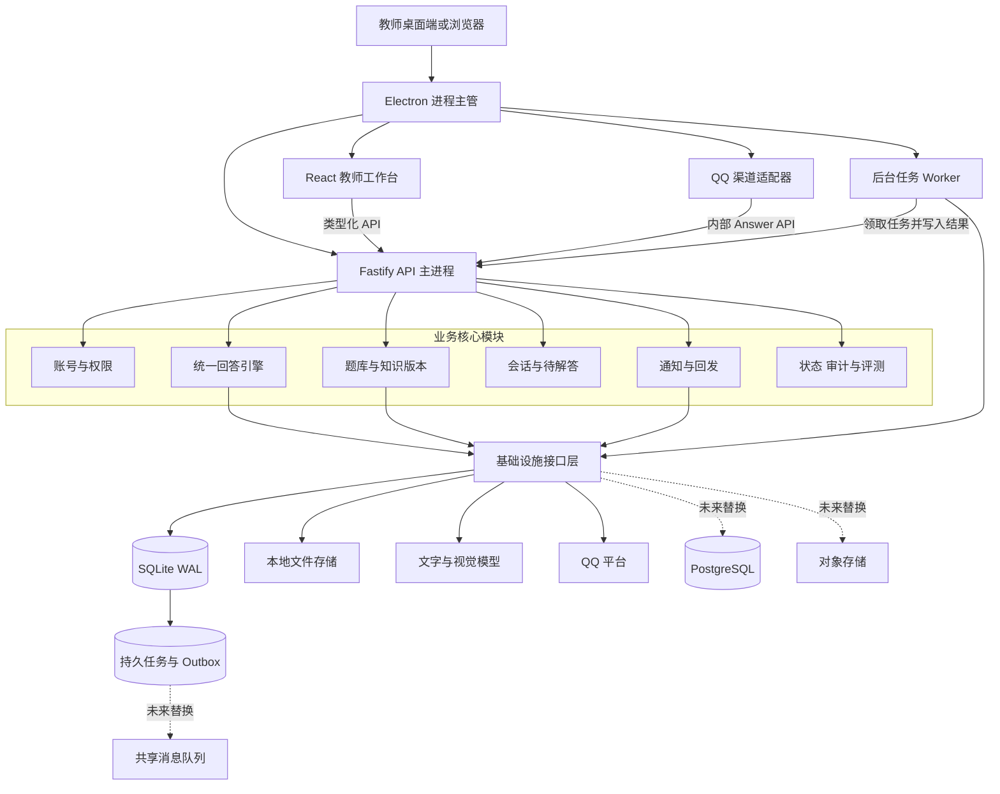
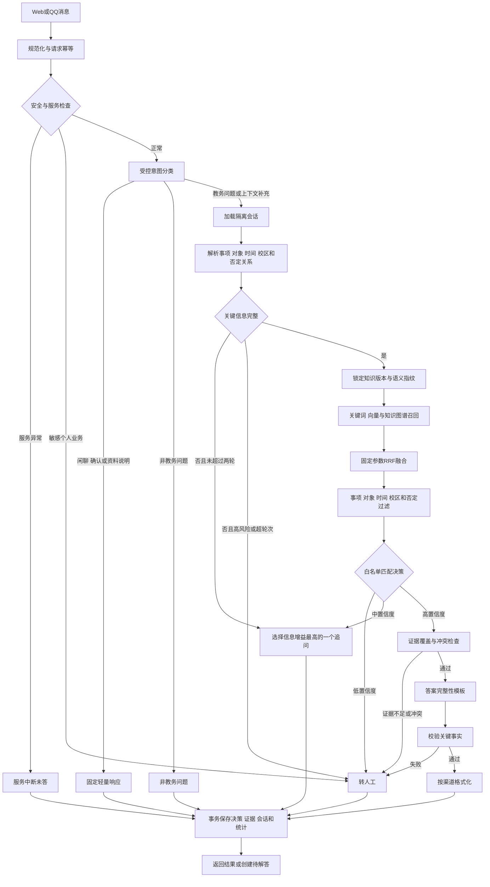
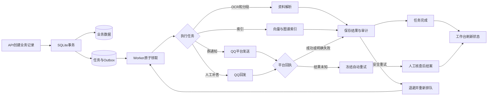
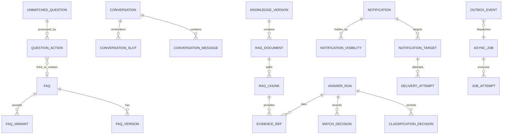
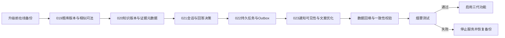
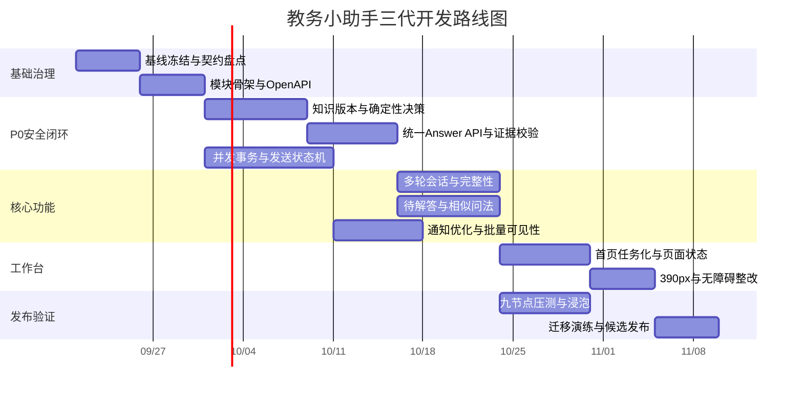

# 教务小助手三代升级设计规格

**状态：** 已确认  
**确认日期：** 2026-09-15  
**产品基线：** campus-secretary-mvp 1.0.3  
**首发部署：** 单位教师电脑，单教师使用  
**演进要求：** 保留局域网、云端和多教师模式的接口边界  
**输入依据：** 《教务小助手三代开发需求清单》、v1.0.3 源码及现有架构与题库维护文档

## 1 结论

三代采用可演进模块化单体。首发仍作为一套 Windows 桌面软件交付，继续使用 Electron、React、Fastify、QQ 适配器、SQLite 和本地文件存储。业务代码按领域拆分，耗时任务由独立 Worker 执行，Web 与 QQ 共用唯一回答应用服务。SQLite、文件系统、QQ 和模型服务均通过接口接入，以便未来替换为 PostgreSQL、对象存储和共享任务队列。

本次升级不引入微服务、Redis、Kafka、Kubernetes 或公网服务。它们不能改善当前单机部署的主要风险，反而会增加安装、诊断和恢复成本。

## 2 范围

### 2.1 本次包含

- 重构待解答、相似问法、快速解答和人工回发流程。
- 增加确定性检索、知识版本锁、答案证据和一致性回放。
- 增加受控意图识别、多轮追问和答案完整性校验。
- 增加通知标题与正文优化、逐字段差异和批量隐藏。
- 把 OCR、长文分段、索引、通知和人工回发迁入持久任务框架。
- 重构教师首页、完整页面状态、390px 布局、键盘与无障碍行为。
- 补齐契约、迁移、API、前端、QQ、压力、浸泡和故障恢复测试。
- 修复需求清单中的 10 个 P0、8 个 P1 和 5 个 P2 问题。

### 2.2 本次不包含

- 多教师同时在线编辑。
- 公网或云端部署。
- 跨机器高可用和自动故障转移。
- 自动执行真实 QQ、真实付费模型或真实数据迁移；这些操作继续单独授权。
- 让大模型自由生成教务政策事实。

## 3 当前代码评估

当前版本已经具备清晰的前后端边界、共享契约、Cookie 与 CSRF 防护、QQ 服务令牌、SQLite WAL、乐观锁、请求去重、通知回执和未命中回发队列。这些能力应保留。

主要结构性问题如下：

| 位置 | 当前问题 | 对三代需求的影响 |
| --- | --- | --- |
| `apps/api/src/app.ts` | 约 96 个路由集中在一个文件 | 难以独立演进权限、契约和错误态 |
| `apps/api/src/db/store.ts` | 一个 Store 覆盖所有数据域 | 事务边界不清晰，未来替换数据库困难 |
| `apps/api/src/services/answer.ts` | 分类、匹配、模型、RAG 和持久化集中编排 | 无法清楚记录首次分叉、证据和多轮状态 |
| `apps/api/src/services/rag.ts` | 解析与索引可占用 API 进程 | OCR 或长文任务可能拖慢实时接口 |
| `apps/web/src/pages/KnowledgeCenter.tsx` | 页面、表单和远程状态混在大型组件中 | 修改相似问法和知识版本容易产生 UI 回归 |
| `apps/web/src/api.ts` | 调用路径以字符串为主 | 静态 OpenAPI 过期时前后端容易失配 |
| `openapi.json` | 只覆盖旧接口子集 | 不能作为当前 96 个接口的可靠联调依据 |
| `data/*.json` | 本机密钥和连接信息分散保存 | 缺少统一凭据保护和轮换边界 |

## 4 质量属性和容量边界

设计以 Windows 10/11、4 核 CPU、16 GB 内存和 SSD 为验收基线。

| 属性 | 目标 |
| --- | --- |
| 消息接收 | 瞬时 20 条/秒，持续 60 秒，共 1,200 条，不丢失、不重复 |
| 本地 FAQ 决策 | 20 条/秒时 p95 不超过 300 ms |
| 首页统计 | p95 小于 500 ms |
| 数据容量 | 10,000 条标准题、50,000 条相似问法、5,000 份资料、100 万条消息 |
| 后台并发 | OCR/索引默认单并发；发送任务按 QQ 平台限制配置 |
| 一致性 | 同输入、同知识版本重复 20 次，FAQ ID、关键事实和结论一致 |
| 可恢复性 | 待解答、追问、通知、回发、OCR 和索引跨重启恢复 |
| 外发安全 | 发送结果未知时禁止自动重发；重复平台调用数为 0 |
| 数据隔离 | 跨账号、跨群聊和跨会话上下文泄漏为 0 |

20 条/秒是消息接收、校验和持久入队能力，不是外部模型每秒完成 20 次推理。付费模型和 CPU 密集任务必须在队列中受独立并发限制。

## 5 目标架构

### 5.1 运行单元

| 运行单元 | 职责 | 故障影响 |
| --- | --- | --- |
| Electron 进程主管 | 启停、健康检查、日志目录和窗口生命周期 | 停止后统一结束子进程 |
| API 主进程 | 登录、查询、命令校验、事务、实时问答 | 不承担 OCR 和长文索引 |
| Worker | OCR、分段、索引、通知和人工回发 | 故障时任务保留，实时管理接口仍可用 |
| QQ 适配器 | 接收平台事件、标准化消息、发送和回执 | 不直接读取业务数据库 |
| React 工作台 | 教师操作和状态展示 | 不保存密钥或复制业务规则 |

这些运行单元仍属于同一个代码库、一个版本和一套安装包。模块化单体描述的是业务所有权和交付边界，不要求所有工作都在同一进程中执行。

### 5.2 领域模块

| 模块 | 负责内容 | 不负责内容 |
| --- | --- | --- |
| Identity | 登录、角色、工作区、开发者解锁和凭据元数据 | 教务业务规则 |
| Knowledge | FAQ、相似问法、分类、知识版本、资料和证据位置 | 渠道格式化 |
| Answering | 语义指纹、召回、RRF、候选决策、证据与完整性检查 | 直接发送 QQ 消息 |
| Conversations | 输入意图、会话、消息、槽位、追问和过期 | 知识内容编辑 |
| Unmatched | 三类待解答、快速解答、关联问题、改分类和撤销 | 模型连接管理 |
| Notifications | 通知草稿、优化、目标、回执、可见性和人工回发 | OCR 和知识索引 |
| Operations | 服务状态、审计、指标、一致性回放和离线评测 | 修改业务事实 |
| Jobs | 任务租约、重试、未知结果和 Outbox 投递 | 决定问答内容 |

## 6 实时问答管道

### 6.1 固定决策顺序

系统必须按以下顺序处理输入：

1. 安全拦截。
2. 服务状态判断。
3. 教务范围判断。
4. 输入意图和信息完整性判断。
5. FAQ 与 RAG 检索。
6. 证据覆盖和冲突检查。
7. 答案完整性检查。
8. 渠道格式化和持久化。

模型只允许执行受控分类、白名单候选选择和表达辅助。系统不得把模型生成的文字直接作为政策事实，也不得在证据未覆盖日期、地点、对象、联系人或办理条件时补写这些字段。

### 6.2 确定性要求

- 语义指纹由规范化输入、事项、对象、时间、校区和否定关系生成。
- 每次运行锁定 `knowledge_version_id` 和检索参数版本。
- 关键词、向量和知识图谱结果按固定 RRF 参数融合，再按稳定键排序。
- 模型只能从候选白名单返回决策，不得返回候选外 FAQ。
- 返回前重新验证 FAQ 和知识版本仍处于可用状态。
- 一致性回放比较每个决策节点，显示首次发生分叉的位置。

## 7 持久后台任务管道

### 7.1 统一任务状态

任务状态为 `pending`、`claimed`、`processing`、`succeeded`、`failed`、`unknown` 和 `cancelled`。领取使用带到期时间的租约。只有没有触发外部副作用，或者平台明确返回可重试失败时，系统才能自动重试。`unknown` 状态必须保留请求、发送时间、目标、平台消息标识和错误证据，由教师核查后结案。

## 8 数据模型

### 8.1 新增实体

| 实体 | 用途 |
| --- | --- |
| `faq_versions` | 保存标准问题、答案、分类和状态的历史版本 |
| `faq_variants` | 保存相似问法、审核状态、启用状态、版本和命中数 |
| `knowledge_versions` | 定义可激活、可回放的知识快照 |
| `answer_runs` | 保存每次回答的输入指纹、知识版本、结论和耗时 |
| `classification_decisions` | 保存输入类型、分类理由和置信层级 |
| `match_decisions` | 保存候选、RRF 分数、白名单决策和首次分叉信息 |
| `evidence_refs` | 保存来源文档、页码、表格位置、标题路径和覆盖字段 |
| `conversations` | 保存工作区、渠道、会话目标、发送者和生命周期 |
| `conversation_messages` | 保存有序消息、平台消息号和去重信息 |
| `conversation_slots` | 保存已填信息、来源消息、置信度和已追问标记 |
| `question_actions` | 保存快速解答、关联、改分类、撤销和冲突记录 |
| `async_jobs` 与 `job_attempts` | 保存任务、租约、尝试次数和执行结果 |
| `outbox_events` | 保证业务事务与任务创建一致 |
| `delivery_attempts` | 保存通知和回发的每次平台调用证据 |
| `notification_visibility` | 隐藏教师视图而不删除发送记录 |
| `content_optimization_runs` | 保存原稿、建议稿、字段差异、额度和确认结果 |

### 8.2 数据访问边界

应用服务只能依赖仓储和 Unit of Work 接口。SQLite 实现保留现有 WAL、外键、busy timeout 和参数化 SQL。ID 使用与数据库无关的稳定字符串；时间统一保存 Unix 毫秒；布尔值在领域层表达，不向上泄漏 SQLite 的整数表示。未来 PostgreSQL 适配器必须通过同一仓储契约测试。

## 9 API 升级

### 9.1 新接口

| API 域 | 主要接口 |
| --- | --- |
| 统一回答 | `POST /answers`、`GET /answers/:id/trace`、`POST /answers/:id/replay` |
| 待解答 | `POST /unmatched/:id/quick-answer`、`POST /unmatched/:id/link-question`、`PATCH /unmatched/:id/classification` |
| 相似问法 | `GET/POST /faqs/:id/variants`、`PATCH /faq-variants/:id` |
| 会话 | `GET /conversations/:id`、`POST /conversations/:id/messages`、`POST /conversations/:id/close` |
| 知识版本 | `GET /knowledge/versions`、`POST /knowledge/versions/:id/activate` |
| 文案优化 | `POST /content-optimizations`、`POST /content-optimizations/:id/accept` |
| 通知记录 | `POST /notifications/visibility/batch`、`GET /notifications/:id/delivery-evidence` |
| 一致性与评测 | `POST /evaluations/runs`、`GET /answer-consistency`、`POST /answer-runs/:id/replay` |
| 任务与状态 | `GET /jobs/:id`、`POST /jobs/:id/retry`、`GET /service-status` |

### 9.2 兼容策略

`POST /admin/answer/test` 与 `POST /internal/qq/answer` 保留一个发布周期，改为调用同一个 `AnswerApplicationService`。其他旧接口通过薄适配层映射到新应用服务。响应头包含弃用信息，但三代首发不删除旧路由。

所有新接口必须具有请求与响应 Schema、权限、资源级工作区校验、幂等键或版本号、统一错误、追踪标识、审计和契约测试。OpenAPI 必须从运行时 Schema 生成，前端客户端由冻结快照生成。CI 检测快照差异，禁止手工维护第二份接口事实。

## 10 前端设计

前端按业务页面、功能组件、远程状态和表单状态拆分。每个查询区明确处理 `loading`、`empty`、`stale`、`error` 和 `success`。弹窗使用统一状态机管理确认、失败回滚、焦点返回和遮罩销毁。所有输入组件在 `compositionstart` 到 `compositionend` 期间禁止 Enter 提交。

教师首页按以下顺序展示：

1. 异常与待办。
2. 分项服务状态。
3. 今日咨询、待处理、需复核和通知失败。
4. 快速解答、发送通知、新增知识和运行评测入口。
5. 7 天或 30 天趋势与质量。

390px 布局不允许页面级横向滚动。表格在窄屏转为卡片或受控局部滚动，主要操作始终可见。颜色不作为唯一状态信号，文字、图标和可见焦点共同表达状态。

## 11 安全与凭据

- API 和 Web 首发只监听 `127.0.0.1`。
- 浏览器继续使用 HttpOnly 会话 Cookie、Origin 校验和 CSRF Token。
- QQ 适配器继续使用 Bearer 服务令牌和 App ID 绑定。
- 模型密钥、QQ Secret 和开发者密钥使用 Windows DPAPI 或系统凭据保护；业务数据库只保存引用和状态。
- 日志不记录口令、令牌、完整个人输入、附件内容或模型密钥。
- 导出回答追踪时默认隐藏发送者平台标识和敏感字段。
- 未来多教师模式必须在仓储查询、缓存键、会话键和任务键中保留 `workspace_id`。

## 12 可观测性

所有 HTTP 请求、回答运行、任务尝试和外部调用使用同一个 `request_id` 或关联 ID。结构化日志至少包含组件、工作区匿名标识、操作、状态、耗时、错误码和重试次数。工作台分别展示消息接收、QQ 回答、主动群发、文字模型、RAG 索引和 Worker 状态；轮询失败时标记数据陈旧，不能继续显示为正常。

核心指标包括消息入队率、队列深度、任务年龄、回答来源、拒答率、人工转接率、不一致率、模型错误率、通知失败率、未知发送数、数据库忙等待和事件循环延迟。

## 13 测试与验收

### 13.1 功能门禁

- P0/01 至 P0/10 全部通过。
- 问题识别 F1 不低于 0.93。
- 首条回答关键信息覆盖率不低于 95%。
- 高风险事项错误答案率不超过 0.5%。
- 答案证据覆盖率为 100%。
- 重复通知和回发平台调用数为 0。
- 跨账号、跨群聊和跨会话上下文泄漏为 0。

### 13.2 测试层次

| 层次 | 覆盖 |
| --- | --- |
| 单元测试 | 指纹、否定关系、RRF、槽位、完整性、状态机和重试策略 |
| 仓储契约测试 | SQLite 仓储、事务、版本冲突、租约和工作区隔离 |
| API 契约测试 | Schema、权限、错误码、幂等、版本和兼容路由 |
| 组件测试 | 页面状态、弹窗、输入法、字段差异和窄屏操作 |
| E2E | 登录、题库、待解答、会话、通知、资料、状态与评测 |
| 压力测试 | 消息、FAQ、RAG、追问、待解答、通知、首页、解析和 SQLite 九类节点 |
| 恢复测试 | API、Worker、QQ、SQLite 和网络中断后的恢复 |

压力测试依次执行烟雾、基准、目标、峰值、两小时浸泡和故障恢复。真实 QQ、真实模型和真实数据迁移的结果必须与自动化结果分开记录。

## 14 迁移和发布

迁移采用先扩展、后双写、再切换、最后清理的顺序。升级前创建数据库和文件清单备份。现有 FAQ 回填为首个版本，当前 RAG 数据标记为初始知识版本。切换读取前比较新旧结果，旧字段和旧接口至少保留一个发布周期。迁移失败时停止三代服务启动，保留原数据库和备份，不执行破坏性回滚 SQL。

## 15 路线图

参考团队为 2 名后端或全栈、1 名前端、1 名测试，计划周期为 10 周。单人开发预计需要 20 至 24 周。

关键路径为基线冻结、契约拆分、知识版本、统一回答、多轮会话、工作台、压测、迁移和发布。通知与持久任务可以在知识版本工作并行推进。

## 16 风险与处置

| 风险 | 概率 | 影响 | 处置 |
| --- | --- | --- | --- |
| 知识版本回填错误 | 中 | 极高 | 备份、行数与校验值比对、只增不删、迁移后回放 |
| QQ 重复外发 | 中 | 极高 | 幂等键、Outbox、平台回执、未知结果冻结 |
| 模型改写政策事实 | 高 | 极高 | 白名单决策、逐字段证据覆盖、失败转人工 |
| OCR 拖慢 API | 高 | 高 | 独立 Worker、单并发、租约与资源指标 |
| 大型前端拆分回归 | 中 | 中 | 先增加组件测试，再逐页迁移，保持路由兼容 |
| SQLite 写锁竞争 | 低至中 | 高 | 短事务、批量写、busy timeout、20 条/秒专项压测 |
| 静态契约再次失真 | 中 | 高 | 运行时生成、CI 差异检查、前端客户端自动生成 |

## 17 架构决策记录

| 决策 | 选择 | 理由 |
| --- | --- | --- |
| 部署拓扑 | 单机模块化单体 | 符合三代首发范围，便于安装与恢复 |
| 数据库 | 继续 SQLite WAL | 单教师场景足够，现有迁移和备份能力可复用 |
| 后台任务 | SQLite 持久任务与 Outbox | 不增加独立中间件，也能跨重启恢复 |
| 渠道一致性 | 共用 AnswerApplicationService | 消除 Web 与 QQ 的事实分叉 |
| 模型权限 | 分类与白名单选择 | 防止模型生成无证据政策事实 |
| 演进路径 | 仓储、存储、任务和渠道接口 | 未来替换基础设施而不重写业务规则 |
| 兼容策略 | 旧接口保留一个发布周期 | 降低桌面端和 QQ 适配器同时切换风险 |

## 18 通过标准

当下列条件同时满足时，三代可以进入候选发布：所有 P0 门禁通过；迁移和恢复演练成功；20 条/秒消息峰值无丢失或重复；两小时浸泡无无法解释的资源增长；桌面和 390px E2E 通过；运行时 OpenAPI 与冻结快照一致；真实外部系统验证已获得单独授权并独立记录。
