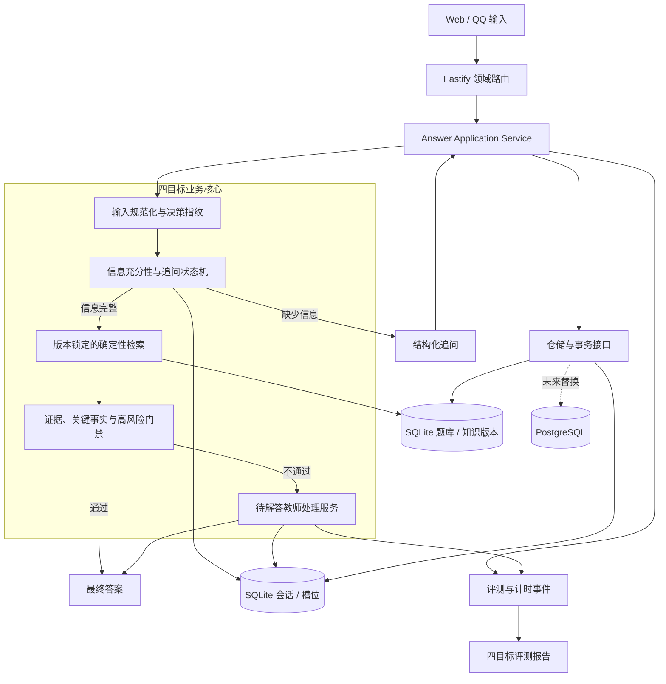
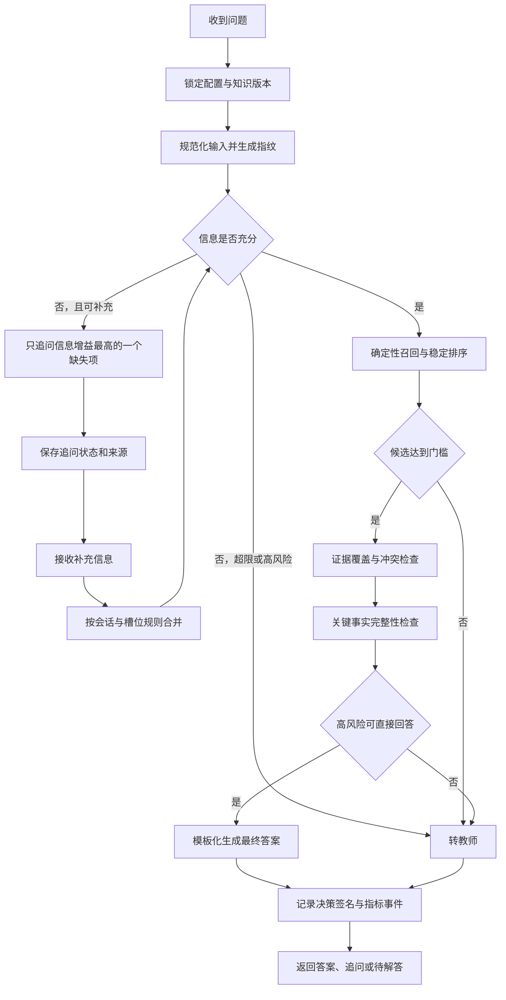
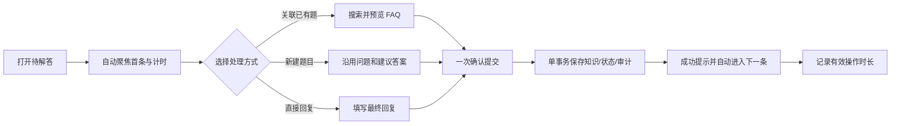

# 教务小助手三代四目标 MVP 设计规格

**状态：** 待用户书面复核

**设计日期：** 2026-09-16

**产品基线：** v1.0.3

**开发基线：** Tasks 1–4 已完成；Task 4 已通过 111 项自动化测试，待最终独立复审

**交付边界：** 单台教师 Windows 电脑、单教师使用，保留未来多教师和服务化接口

**时间盒：** 两个开发日

## 1. 决策

三代首个 MVP 只交付并验证以下四个结果：答案正确、匹配稳定、追问有效、教师提效。功能是否进入 MVP，不再按原需求清单中的模块数量判断，而是按其是否直接形成四项指标的可测闭环判断。

已完成的共享契约、领域路由、仓储接口和事务边界作为基础保留。原 19 项计划中与四项结果无直接关系的通知扩展、通用后台任务、资料解析扩展、多用户、云端部署、全量九节点压测和安装包制作全部延期。瞬时 20 条/秒保留为后续容量目标，不作为本次两日 MVP 的发布门禁。

## 2. 唯一验收目标

| 目标 | 样本与测量方式 | MVP 目标值 | 自动门禁 |
| --- | --- | --- | --- |
| 答案正确 | 在教师标注的冻结题库/RAG 黄金集上比较最终结论、FAQ ID、关键事实和风险处置 | 总正确率 ≥ 95%；高风险错误答案率 ≤ 1% | `eval:correctness` |
| 匹配稳定 | 同一问题、同一知识版本、同一配置独立执行 20 次 | 一致性 ≥ 99%；每条样本的 FAQ ID 与关键事实必须一致 | `eval:stability` |
| 追问有效 | 在冻结的信息不足样本上测量是否应追问，并回放补充信息后的闭环结果 | 追问判断 F1 ≥ 0.90；任务完成率 ≥ 90% | `eval:followup` |
| 教师提效 | 对 v1.0.3 与 MVP 执行同一批待解答任务，记录从打开到完成的有效操作时长 | 中位操作时长较 v1.0.3 下降 ≥ 40% | `eval:teacher-efficiency` |

如果教师黄金集、追问标注集或 v1.0.3 时长基线在两日内未就绪，系统仍须完成采集、冻结、运行和报告能力，但相应业务指标只能报告“待真实数据验证”，不得用合成样本宣称达标。

### 2.1 指标口径

- `答案正确率 = 正确样本数 / 全部可判定样本数`。正确要求最终结论正确，且标注为必填的关键事实全部一致。
- `高风险错误答案率 = 高风险错误且被系统直接回答的样本数 / 全部高风险样本数`。正确拒答、追问或转教师不计为错误答案。
- `匹配一致性 = 与该样本首次运行的决策签名一致的运行次数 / 总运行次数`。决策签名至少包含 FAQ ID、知识版本、关键事实和处置类型。
- 追问判断使用教师标注的“应追问/不应追问”计算 precision、recall 和 F1。
- `任务完成率 = 补充信息后得到正确答案或正确转教师的样本数 / 已发起追问样本数`。
- 教师操作时长排除网络或模型等待时间，使用前端埋点记录有效交互区间；同时保留端到端耗时供诊断，不混入口径。

## 3. 范围

### 3.1 MVP 必须包含

1. 冻结的评测数据格式、数据校验器、四项指标运行器和机器可读报告。
2. 题库/知识版本快照、稳定规范化、确定性候选排序和决策签名。
3. FAQ 与 RAG 证据覆盖检查、关键事实校验和高风险处置门禁。
4. 信息充分性判断、结构化缺失项、单问题追问、补充信息合并及闭环。
5. 待解答的快速关联 FAQ、快速建题、直接答复、提交后自动进入下一条和操作计时。
6. Web 与 QQ 共用同一回答应用服务；评测不得绕开生产决策链路复制规则。
7. 每次评测记录代码版本、知识版本、配置版本和随机性配置，保证结果可复现。

### 3.2 明确延期

- 通知中心增强、通知文案优化和批量隐藏。
- 通用 Worker、Outbox、OCR/长文解析迁移以及资料中心扩展。
- 多教师并发编辑、局域网共享、公网或云端部署。
- 全量前端重构、视觉换肤和与四项指标无关的页面改造。
- 20 条/秒容量门禁、九节点压力测试和长时间浸泡测试。
- 真实 QQ 群、真实付费模型和真实生产数据的自动调用。
- 安装包与便携包制作；只有用户明确说“确认打包”后执行。

## 4. MVP 架构

保留模块化单体，不新增微服务、Redis 或消息中间件。未来扩展通过现有仓储、事务和应用服务接口完成，不为尚未发生的多用户场景增加运行复杂度。

## 5. 实时问答与评测管道

### 5.1 稳定性规则

- 规范化规则、召回参数、阈值和提示词均有版本号。
- 所有候选先按分数排序，再按稳定键打破并列；禁止依赖数据库未指定顺序或对象遍历顺序。
- 评测模式关闭温度和非确定性采样；模型只允许从候选白名单选择，不得创建 FAQ ID。
- 每个最终结果保存决策签名；20 次回放比较签名而不是只比较自然语言表述。
- 知识版本或配置变化后必须创建新的评测批次，禁止与旧批次混算。

### 5.2 正确性与风险规则

- 黄金样本包含期望处置类型、FAQ ID、必需关键事实、可接受表述和风险等级。
- RAG 答案的每个政策事实必须能映射到冻结知识版本中的证据片段。
- 证据缺失、证据冲突、候选接近或高风险字段不完整时，系统追问或转教师，不猜测答案。
- 高风险样本至少覆盖截止日期、考试资格、成绩/学籍、缴费和个人敏感事项；最终清单由教师确认。

### 5.3 追问状态机

状态仅包含 `received → needs_clarification → ready_to_answer → answered | escalated`。每轮只问一个缺失项，默认最多两轮；同一缺失项不得重复询问。补充消息必须按工作区、渠道、会话目标和发送者隔离，过期上下文不得参与新问题。

## 6. 教师提效闭环

MVP 只优化完成一条待解答所需的关键路径：减少页面跳转、重复录入和鼠标操作。批量处理、复杂统计大屏和无关页面重构不进入本时间盒。提交失败时保留当前输入并停止计时；服务端冲突返回可重试状态，不允许静默覆盖。

## 7. 数据与接口

优先扩展现有表和接口，不建立第二套问答系统。必要新增数据包括：

- `knowledge_version`：题库/RAG 内容与可用状态的冻结版本。
- `decision_trace`：输入指纹、候选、FAQ ID、证据、关键事实、配置版本和最终处置。
- `conversation_slot`：缺失项、已填值、来源消息、置信度和已追问标记。
- `evaluation_run/result`：评测批次、代码版本、数据集版本、单样本结果和聚合指标。
- `teacher_task_timing`：任务、版本、有效操作区间、端到端耗时和完成方式。

评测接口只负责创建、执行和读取评测批次；修改黄金标注必须走独立的教师维护动作并留下版本，不允许评测运行自动改写期望答案。

## 8. 错误处理与可追溯性

- 无法加载冻结知识版本：停止自动回答，返回明确服务状态并记录失败原因。
- 模型超时或输出不符合白名单：降级为确定性 FAQ 结果；无可靠结果则转教师。
- 追问状态冲突：使用现有乐观锁返回冲突，客户端刷新后重试。
- 教师提交事务失败：知识、待解答状态、审计和回复目标全部回滚。
- 评测样本无效：该批次失败并列出样本错误，不从分母中静默删除。
- 报告必须能从聚合指标下钻到失败样本和首次决策分叉。

## 9. 两日实施切片

### 开发日 1：回答质量闭环

1. 冻结四项评测数据契约与失败测试。
2. 实现知识/配置版本、输入指纹、稳定排序和决策签名。
3. 实现证据、关键事实和高风险门禁。
4. 实现信息充分性、追问状态和补充信息回放。
5. 完成后端局部测试、全量回归和第一批 Git 提交。

### 开发日 2：教师闭环与发布证据

1. 收缩待解答工作台为三条最短处理路径并增加计时。
2. 完成四个评测运行器、报告和门禁命令。
3. 完成前后端联调、20 次一致性回放和关键 E2E。
4. 修复阻断 Bug，更新 Bug 台账、README 和验收记录。
5. 分别提交前后端版本并推送远端；不制作安装包。

这是开发时间盒，不代表在缺少教师标注集或 v1.0.3 基线时可以宣称业务指标达标。

## 10. 测试策略

| 层次 | 最小覆盖 |
| --- | --- |
| 单元测试 | 规范化、稳定排序、决策签名、关键事实校验、追问状态、计时器 |
| 仓储契约 | 知识版本、决策追踪、会话槽位、待解答原子提交 |
| 集成测试 | Web/QQ 共用回答链；补充信息后闭环；高风险不可靠答案被拦截 |
| 稳定性测试 | 每条冻结样本运行 20 次并比较 FAQ ID、关键事实和处置类型 |
| 前端测试 | 三种教师处理路径、冲突、失败保留输入、自动下一条、计时事件 |
| E2E | 问题→追问→答案；问题→待解答→教师处理→下一条 |
| 回归测试 | 现有后端、前端、类型检查和生产构建全部通过 |

禁止只用 mock 证明数据库事务、路由契约或并发冲突；这些路径必须至少有一个真实 SQLite/Fastify 集成测试。

## 11. 完成定义

MVP 只有在以下条件同时满足时才可标记完成：

1. 四项目标均存在版本化数据集、可重复运行命令和逐样本报告。
2. 有真实教师数据的指标达到目标；缺少真实数据的指标明确标记待验证。
3. 新增和现有自动化测试、类型检查、生产构建全部通过。
4. P0/P1 Bug 为零；其余 Bug 进入可追踪台账并注明复现步骤和影响。
5. 前后端分别提交到 Git，提交、标签和远端分支可追溯。
6. 没有把延期功能、真实密钥、运行数据库或本机题库文档带入提交。

## 12. 后续升级接口

MVP 不实现多教师和云部署，但保持以下边界：所有业务记录继续携带工作区标识；仓储和事务接口不绑定 SQLite 调用方；回答应用服务不依赖 QQ；知识版本与配置版本显式传递；评测数据不读取前端本地状态。这些边界足以支持后续 PostgreSQL、共享队列和多教师权限扩展，无需在本次实现对应基础设施。
