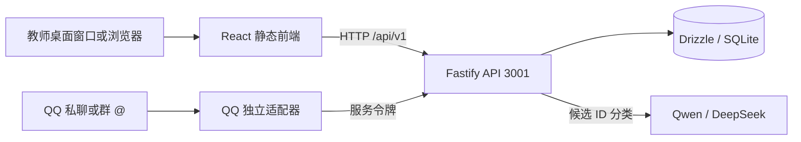

# 架构与设计

## 前后端边界

部署可同机，工程与进程相互独立。`apps/web` 只依赖公共契约和浏览器依赖；`apps/qq-bot` 不读 API 数据库。`packages/contracts` 不含模型客户端、数据库、密钥配置或服务器代码。

MVP 使用模块化单体 API，便于稳定维护。没有为当前规模引入微服务、消息队列、向量数据库或身份绑定。

## 后端分层与关键行为

| 层 | 位置 | 职责 |
|---|---|---|
| 接口层 | apps/api/src/app.ts | Schema 校验、路由、会话、Origin/CSRF、服务鉴权、限流、统一错误 |
| 问答服务 | services/answer.ts | QQ 与教师测试共享、去重、关键词匹配、模型配额、版本复核、统计与未命中事务 |
| 模型适配 | services/model.ts | DeepSeek 15 秒 / Qwen 40 秒超时、JSON Output、64 KB 响应上限、严格 ID 白名单、无重试 |
| 输入规则 | services/policy.ts | 常见敏感信息、注入、越界提示，多事项保守处理，候选裁剪 |
| 认证服务 | services/auth.ts | scrypt 随机盐口令哈希、恒定时间比较、随机会话与 CSRF |
| 数据层 | db/store.ts | Drizzle FAQ CRUD、参数化 SQL、SQLite 事务、聚合与版本控制 |
| 本机维护 | cli.ts | 初始化、账号管理、导入/导出、在线备份、停止服务后的恢复 |

问答顺序：输入规则 → 标准问题精确匹配 → 具体关键词唯一命中 → 老师选择的文字模型结构化选择 → 回读当前启用的 FAQ 答案。模型输出只接受 `faqId` 与 `match`；拒绝空内容、截断、额外字段或候选外 ID。FAQ 改版/停用后，缓存请求和正在进行的模型请求都不能继续返回旧版本。

未配置模型时保持关键词服务。没有明确匹配时提示联系教务老师；不会返回模型自行编写的政策。输入识别不是通用脱敏系统，不应收集个人业务资料。

图片先由 Qwen 提取公开教务问题，再走知识匹配。模型默认并发 2，共享每周 20 元保守预算，连接测试也计入。独立 SQLite model-budget.db 使用即时事务在发送前预留，按服务商返回的输入/输出 Token 结算；未知结果保留预占。按北京时间周一重置，重启不清零，达到额度、容量或超时均提示，不自动重试付费请求。详见《模型与周额度使用说明》。

请求 ID 按渠道命名空间哈希保存 24 小时；相同 ID 与问题共享结果，相同 ID 携带不同问题返回 409。进程中断的 processing 记录返回中断提示，不重复扣费。此机制是应用层幂等，不是 QQ 平台严格一次投递保证。

## 数据表

| 表 | 核心字段 / 用途 |
|---|---|
| faqs | id、标准问题/答案、关键词 JSON、分类、状态、版本、演示标记、更新时间 |
| admin_users | id、唯一用户名、带随机盐的口令哈希 |
| sessions | token 哈希、user_id、CSRF、8 小时到期时间 |
| unmatched_questions | 规范化问题哈希、问句、原因、双渠道次数、处理状态、关联 FAQ |
| question_daily | 日期 + 渠道 + 命中/回退指标主键、累计次数 |
| model_usage | 日期、调用次数、失败次数、服务商返回的 Token 用量 |
| request_dedup | 哈希请求 ID、问题哈希、处理状态、返回结果、到期时间 |
| admin_audit | 操作者、动作、FAQ ID/版本、时间，不重复保存答案全文 |
| schema_migrations | 已应用的迁移版本 |

只有已过滤并且未命中/含糊的教务问句进入待处理记录。QQ 来源使用平台 OpenID 在后台区分学生，并记录平台提供的昵称；界面不展示 OpenID。数字 QQ 号由平台明确字段提供或由老师根据班级名单核实补录后才显示。同一问句按学生分别累计咨询次数。会话/幂等定期清理；未命中及其学生来源保留 30 天，按最后咨询时间计算。全局统计不包含学生身份。登录口令重置和恢复数据库后旧会话失效。

SQLite WAL 适用于本版单机、少量老师编辑的部署；并发写入通过事务和 busy timeout 处理。未来高可用、多个 API 副本或更大规模需迁移集中式数据库，并把限流/并发池移至共享存储。

## HTTP 契约

全局前缀 `/api/v1`，浏览器 Cookie 同源，QQ 使用 Bearer 服务令牌。

| 方法 | 路径 | 权限 / 行为 |
|---|---|---|
| GET | /health/live、/health/ready | 公开；进程与数据库探针 |
| GET | /status | 服务状态 |
| POST | /admin/answer/test | 老师 + CSRF；受保护的问答测试入口 |
| POST | /auth/login | 登录；每分钟每 IP 5 次 |
| GET | /auth/session | 老师；恢复会话和 CSRF |
| POST | /auth/logout | 老师 + CSRF；清除会话 |
| GET | /faqs | 老师；查询、分类、状态、分页 |
| POST | /faqs | 老师 + CSRF；新建 |
| PATCH | /faqs/:id | 老师 + CSRF；必须携带最新 version |
| GET | /unmatched | 老师；未命中列表 |
| POST | /unmatched/:id/resolve | 老师 + CSRF；create/link/ignore |
| GET | /admin/status | 老师；真实统计、配置与心跳 |
| GET | /admin/models | 老师；模型连接状态、Token、额度百分比，不返回密钥或金额 |
| POST | /admin/models/:provider/connect | 老师 + CSRF；保存密钥并真实验证，每分钟 5 次 |
| POST | /admin/models/:provider/disconnect、/admin/models/select | 老师 + CSRF；断开或选择文字模型 |
| GET | /admin/openapi | 老师；运行时 OpenAPI |
| POST | /internal/qq/answer | 机器人服务令牌；同一问答服务 |
| POST | /internal/qq/heartbeat | 机器人服务令牌；连接状态上报 |

成功问答返回 `requestId, answer, faqId, faqVersion, source, fallbackReason, isDemo`。失败返回 `{error:{code,message}, requestId}`。常见状态：400 参数无效、401 未登录/令牌无效、403 来源/CSRF、404 不存在、409 版本或去重冲突、429 限流、503 服务不可用。

完整机器可读定义见 `openapi.json`。它从实际运行路由生成，不是手工接口样例。

## taste-skill 设计执行

- 使用 `design-taste-frontend` 的公共服务适配原则，设计参数 3 / 2 / 5；管理端参考同包 `minimalist-ui`。
- 按本轮要求改为白底、墨色文字、宋体标题与朱红印章点缀；独立水墨山水图只出现在边缘，不覆盖表单。
- 导航稳定、正文优先；教师工作台为唯一页面入口，模型分卡展示，共享额度汇总，手机按阅读顺序排列。
- 管理指标来自真实 API，初始空数据显示 0 或「—」，没有虚构趋势和运营数字。
- 官方 Fluent UI 提供按钮、表单、选择、复选框、消息栏和受控弹窗；知识列表为语义 HTML 表格，手机转为条目布局，编辑按钮保持可见。
- 白底水墨主题，支持键盘、可见焦点、Enter/Shift+Enter、输入法组合状态、Escape 关闭侧栏和减少动效设置。
- 每个关键操作提供加载、错误、空状态与成功反馈。启用知识需确认内容；冲突不会静默覆盖。

前端技能来源：[Leonxlnx/taste-skill](https://github.com/Leonxlnx/taste-skill)。既有技能库在 `D:\003\技能资源包\前端\.agents\skills`，不影响本项目独立运行。

后端技能来源：[wshobson/agents nodejs-backend-patterns](https://github.com/wshobson/agents/tree/main/plugins/javascript-typescript/skills/nodejs-backend-patterns)。安装指纹在根目录 `skills-lock.json`。其分层、环境配置、集中错误、鉴权、校验和可注入测试模式已落实到上述代码。

技术参考：[Fastify 校验与序列化](https://fastify.dev/docs/latest/Reference/Validation-and-Serialization/)、[Vite 静态部署](https://vite.dev/guide/static-deploy.html)、[Fluent UI 官方组件](https://github.com/microsoft/fluentui/tree/master/packages/react-components)、[QQ SDK](https://github.com/tencent-connect/qqbot-nodejs)。生产入口使用独立静态服务器，不使用 Vite preview 长期运行。
